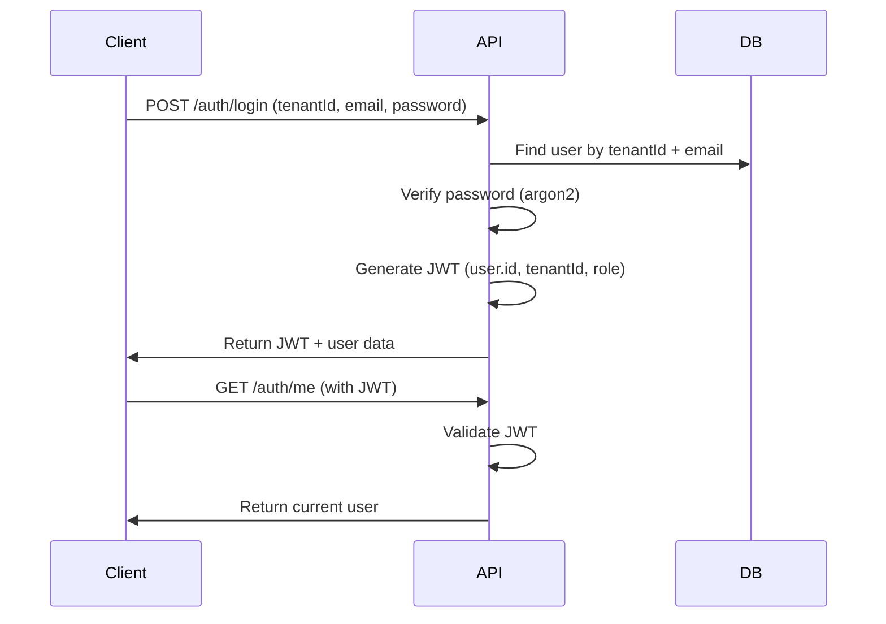

# Sprint 1 API Design

## Sprint 1: Tenant, Auth & Core Roles

**Goal:** Secure access and tenant isolation

**Deliverables:**

- Tenant creation
- User authentication (login/logout)
- Role-based access control (RBAC)
- User management (Kepala Sekolah, TU, Guru)
- Enforced tenant isolation (`tenant_id`)

---

## Table of Contents

1. [Overview](#overview)
2. [Authentication Flow](#authentication-flow)
3. [API Endpoints](#api-endpoints)
   - [Authentication](#authentication)
   - [Tenant Management](#tenant-management)
   - [User Management](#user-management)
   - [Profile Management](#profile-management)
4. [Data Models](#data-models)
5. [Authorization Matrix](#authorization-matrix)
6. [Error Handling](#error-handling)
7. [Security Considerations](#security-considerations)

---

## Overview

### Architecture Principles

1. **Tenant Isolation**: All data queries MUST be scoped by `tenantId` from JWT
2. **Hybrid RBAC**: Fixed roles (PRINCIPAL, ADMIN_STAFF, TEACHER, STUDENT) with configurable permissions
3. **Stateless Authentication**: JWT-based authentication with refresh capabilities
4. **Response Standardization**: All responses follow standard format (see [RESPONSE-STANDARDIZATION.md](../apps/backend/src/common/RESPONSE-STANDARDIZATION.md))
5. **Profile Separation**: User identity (login) is separate from role-specific profiles (Teacher, Student)

### Base URL

```
http://localhost:5000
```

### Authentication

All endpoints except public ones require JWT Bearer token:

```
Authorization: Bearer <jwt_token>
```

### Response Format

#### Success Response

```typescript
{
  message: string;
  statusCode: number;
  success: boolean;
  data: any;
}
```

#### Error Response

```typescript
{
  statusCode: number;
  message: string;
  error: string;
}
```

---

## Authentication Flow

### Registration Flow

1. **Admin (PRINCIPAL/ADMIN_STAFF) creates tenant** (if needed)
2. **Admin registers users** with role assignment
3. User receives credentials
4. User logs in and receives JWT token

### Login Flow



### JWT Payload

```typescript
{
  sub: string; // User ID
  tenantId: string; // Tenant ID
  email: string; // User email
  role: Role; // User role (PRINCIPAL, ADMIN_STAFF, TEACHER, STUDENT)
  iat: number; // Issued at
  exp: number; // Expires at
}
```

---

## API Endpoints

### Authentication

#### POST /auth/register

**Description**: Register a new user (Admin only)

**Access**: `@Roles(Role.PRINCIPAL, Role.ADMIN_STAFF)` + `@RequirePermissions(Permission.USER_CREATE)`

**Request Body**:

```typescript
{
  tenantId: string;      // UUID
  email: string;         // Valid email
  password: string;      // Min 8 characters
  name: string;          // Full name
  role: Role;            // PRINCIPAL | ADMIN_STAFF | TEACHER | STUDENT

  // Optional user-level attributes
  gender?: "MALE" | "FEMALE";
  dateOfBirth?: string;  // ISO 8601 date
  phoneNumber?: string;
}
```

**Response** `201 Created`:

```typescript
{
  message: "User registered successfully",
  statusCode: 201,
  success: true,
  data: {
    user: {
      id: string;
      tenantId: string;
      email: string;
      name: string;
      role: Role;
      gender: Gender | null;
      dateOfBirth: string | null;
      phoneNumber: string | null;
      createdAt: string;
    },
    accessToken: string;
  }
}
```

**Error Responses**:

- `409 Conflict` - Email already registered for this tenant
- `400 Bad Request` - Validation errors
- `403 Forbidden` - Insufficient permissions

---

#### POST /auth/login

**Description**: Authenticate user and receive JWT token

**Access**: `@Public()`

**Request Body**:

```typescript
{
  tenantId: string; // UUID
  email: string; // Registered email
  password: string; // User password
}
```

**Response** `200 OK`:

```typescript
{
  message: "Login successful",
  statusCode: 200,
  success: true,
  data: {
    user: {
      id: string;
      tenantId: string;
      email: string;
      name: string;
      role: Role;
      gender: Gender | null;
      dateOfBirth: string | null;
      phoneNumber: string | null;
      createdAt: string;
    },
    accessToken: string;
  }
}
```

**Error Responses**:

- `401 Unauthorized` - Invalid credentials
- `400 Bad Request` - Validation errors

**Example**:

```bash
curl -X POST http://localhost:5000/auth/login \
  -H "Content-Type: application/json" \
  -d '{
    "tenantId": "550e8400-e29b-41d4-a716-446655440000",
    "email": "admin@school.com",
    "password": "SecurePass123"
  }'
```

---

#### GET /auth/me

**Description**: Get current authenticated user information

**Access**: Authenticated users only

**Response** `200 OK`:

```typescript
{
  message: "User retrieved successfully",
  statusCode: 200,
  success: true,
  data: {
    user: {
      sub: string;      // User ID from JWT
      tenantId: string;
      email: string;
      role: Role;
    }
  }
}
```

**Error Responses**:

- `401 Unauthorized` - Invalid or missing JWT

**Example**:

```bash
curl -X GET http://localhost:5000/auth/me \
  -H "Authorization: Bearer <jwt_token>"
```

---

#### POST /auth/logout

**Description**: Logout current user (client-side token removal)

**Access**: Authenticated users only

**Note**: Since we use stateless JWT, logout is primarily handled client-side by removing the token. This endpoint is provided for consistency and potential future session management.

**Response** `200 OK`:

```typescript
{
  message: "Logout successful",
  statusCode: 200,
  success: true,
  data: null
}
```

---

### Tenant Management

#### POST /tenants

**Description**: Create a new tenant (school)

**Access**: `@Public()` for MVP (first tenant setup) or Super Admin in production

**Request Body**:

```typescript
{
  name: string; // School name (e.g., "SD Negeri 1 Jakarta")
}
```

**Response** `201 Created`:

```typescript
{
  message: "Tenant created successfully",
  statusCode: 201,
  success: true,
  data: {
    id: string;
    name: string;
    activeAcademicYearId: null;
    createdAt: string;
    updatedAt: string;
  }
}
```

**Error Responses**:

- `409 Conflict` - Tenant name already exists
- `400 Bad Request` - Validation errors

**Example**:

```bash
curl -X POST http://localhost:5000/tenants \
  -H "Content-Type: application/json" \
  -d '{
    "name": "SD Negeri 1 Jakarta"
  }'
```

---

#### GET /tenants/:id

**Description**: Get tenant information

**Access**: `@Roles(Role.PRINCIPAL, Role.ADMIN_STAFF)` + `@RequirePermissions(Permission.TENANT_READ)`

**Response** `200 OK`:

```typescript
{
  message: "Tenant retrieved successfully",
  statusCode: 200,
  success: true,
  data: {
    id: string;
    name: string;
    activeAcademicYearId: string | null;
    createdAt: string;
    updatedAt: string;
  }
}
```

**Error Responses**:

- `404 Not Found` - Tenant not found
- `403 Forbidden` - User's tenantId doesn't match requested tenant

---

#### PATCH /tenants/:id

**Description**: Update tenant information

**Access**: `@Roles(Role.PRINCIPAL)` + `@RequirePermissions(Permission.TENANT_UPDATE)`

**Request Body**:

```typescript
{
  name?: string;  // School name
}
```

**Response** `200 OK`:

```typescript
{
  message: "Tenant updated successfully",
  statusCode: 200,
  success: true,
  data: {
    id: string;
    name: string;
    activeAcademicYearId: string | null;
    updatedAt: string;
  }
}
```

**Error Responses**:

- `404 Not Found` - Tenant not found
- `403 Forbidden` - Insufficient permissions

---

### User Management

#### GET /users

**Description**: List all users in the tenant

**Access**: `@Roles(Role.PRINCIPAL, Role.ADMIN_STAFF)` + `@RequirePermissions(Permission.USER_READ)`

**Query Parameters**:

```typescript
{
  offset?: number;    // Default: 0
  limit?: number;     // Default: 10, Max: 100
  sort?: string;      // Default: "createdAt"
  order?: "asc" | "desc";  // Default: "desc"
  role?: Role;        // Filter by role
  search?: string;    // Search by name or email
}
```

**Response** `200 OK`:

```typescript
{
  message: "Users retrieved successfully",
  statusCode: 200,
  success: true,
  data: [
    {
      id: string;
      tenantId: string;
      email: string;
      name: string;
      role: Role;
      gender: Gender | null;
      dateOfBirth: string | null;
      phoneNumber: string | null;
      createdAt: string;
      updatedAt: string;
    }
  ],
  meta: {
    offset: number;
    limit: number;
    sort: string;
    order: string;
  }
}
```

**Example**:

```bash
curl -X GET "http://localhost:5000/users?role=TEACHER&limit=20" \
  -H "Authorization: Bearer <jwt_token>"
```

---

#### GET /users/:id

**Description**: Get specific user details

**Access**:

- `@Roles(Role.PRINCIPAL, Role.ADMIN_STAFF)` + `@RequirePermissions(Permission.USER_READ)` for any user
- Any authenticated user for their own profile

**Response** `200 OK`:

```typescript
{
  message: "User retrieved successfully",
  statusCode: 200,
  success: true,
  data: {
    id: string;
    tenantId: string;
    email: string;
    name: string;
    role: Role;
    gender: Gender | null;
    dateOfBirth: string | null;
    phoneNumber: string | null;
    createdAt: string;
    updatedAt: string;

    // Include profile if role is TEACHER or STUDENT
    teacherProfile?: {
      id: string;
      nip: string | null;
      nuptk: string | null;
      hiredAt: string | null;
      additionalIdentifiers: any;
    };
    studentProfile?: {
      id: string;
      nis: string | null;
      nisn: string | null;
      additionalIdentifiers: any;
    };
  }
}
```

**Error Responses**:

- `404 Not Found` - User not found
- `403 Forbidden` - Insufficient permissions or tenant mismatch

---

#### PATCH /users/:id

**Description**: Update user information

**Access**:

- `@Roles(Role.PRINCIPAL, Role.ADMIN_STAFF)` + `@RequirePermissions(Permission.USER_UPDATE)` for any user
- Any authenticated user for their own basic profile (name, phone, etc.)

**Request Body**:

```typescript
{
  name?: string;
  email?: string;       // Admin only
  role?: Role;          // Admin only, cannot change own role
  gender?: "MALE" | "FEMALE";
  dateOfBirth?: string; // ISO 8601
  phoneNumber?: string;
}
```

**Response** `200 OK`:

```typescript
{
  message: "User updated successfully",
  statusCode: 200,
  success: true,
  data: {
    id: string;
    tenantId: string;
    email: string;
    name: string;
    role: Role;
    gender: Gender | null;
    dateOfBirth: string | null;
    phoneNumber: string | null;
    updatedAt: string;
  }
}
```

**Error Responses**:

- `404 Not Found` - User not found
- `403 Forbidden` - Insufficient permissions
- `409 Conflict` - Email already in use
- `400 Bad Request` - Cannot change own role

**Business Rules**:

- Users cannot change their own role
- Email must be unique within tenant
- Only admins can change user roles

---

#### DELETE /users/:id

**Description**: Soft delete or deactivate user

**Access**: `@Roles(Role.PRINCIPAL, Role.ADMIN_STAFF)` + `@RequirePermissions(Permission.USER_DELETE)`

**Response** `200 OK`:

```typescript
{
  message: "User deleted successfully",
  statusCode: 200,
  success: true,
  data: null
}
```

**Error Responses**:

- `404 Not Found` - User not found
- `403 Forbidden` - Insufficient permissions or cannot delete self
- `400 Bad Request` - Cannot delete own account

**Business Rules**:

- Users cannot delete themselves
- Consider implementing soft delete (isActive flag) for data integrity
- Cascade rules: preserve audit trail, mark related records as inactive

---

#### POST /users/:id/reset-password

**Description**: Admin resets user password

**Access**: `@Roles(Role.PRINCIPAL, Role.ADMIN_STAFF)` + `@RequirePermissions(Permission.USER_UPDATE)`

**Request Body**:

```typescript
{
  newPassword: string; // Min 8 characters
}
```

**Response** `200 OK`:

```typescript
{
  message: "Password reset successfully",
  statusCode: 200,
  success: true,
  data: null
}
```

**Error Responses**:

- `404 Not Found` - User not found
- `403 Forbidden` - Insufficient permissions
- `400 Bad Request` - Password validation failed

---

#### PATCH /users/:id/change-password

**Description**: User changes their own password

**Access**: Authenticated user (own account only)

**Request Body**:

```typescript
{
  currentPassword: string;
  newPassword: string; // Min 8 characters
}
```

**Response** `200 OK`:

```typescript
{
  message: "Password changed successfully",
  statusCode: 200,
  success: true,
  data: null
}
```

**Error Responses**:

- `401 Unauthorized` - Current password incorrect
- `400 Bad Request` - Password validation failed

---

### Profile Management

Profile endpoints manage role-specific attributes for Teachers and Students.

#### POST /profiles/teacher

**Description**: Create teacher profile for existing user

**Access**: `@Roles(Role.PRINCIPAL, Role.ADMIN_STAFF)` + `@RequirePermissions(Permission.TEACHER_CREATE)`

**Request Body**:

```typescript
{
  userId: string;       // User ID with TEACHER role
  nip?: string;         // Nomor Induk Pegawai
  nuptk?: string;       // Nomor Unik Pendidik dan Tenaga Kependidikan
  hiredAt?: string;     // ISO 8601 date
  additionalIdentifiers?: Record<string, any>;
}
```

**Response** `201 Created`:

```typescript
{
  message: "Teacher profile created successfully",
  statusCode: 201,
  success: true,
  data: {
    id: string;
    tenantId: string;
    userId: string;
    nip: string | null;
    nuptk: string | null;
    hiredAt: string | null;
    additionalIdentifiers: any;
    createdAt: string;
    updatedAt: string;
  }
}
```

**Error Responses**:

- `404 Not Found` - User not found
- `400 Bad Request` - User already has a teacher profile or user role is not TEACHER
- `409 Conflict` - NIP or NUPTK already exists in tenant

**Business Rules**:

- User must have `TEACHER` role
- NIP and NUPTK must be unique within tenant
- One user can have only one teacher profile

---

#### GET /profiles/teacher/:id

**Description**: Get teacher profile by ID

**Access**: `@RequirePermissions(Permission.TEACHER_READ)`

**Response** `200 OK`:

```typescript
{
  message: "Teacher profile retrieved successfully",
  statusCode: 200,
  success: true,
  data: {
    id: string;
    tenantId: string;
    userId: string;
    user: {
      id: string;
      name: string;
      email: string;
      gender: Gender | null;
      dateOfBirth: string | null;
      phoneNumber: string | null;
    };
    nip: string | null;
    nuptk: string | null;
    hiredAt: string | null;
    additionalIdentifiers: any;
    createdAt: string;
    updatedAt: string;
  }
}
```

---

#### GET /profiles/teacher/user/:userId

**Description**: Get teacher profile by user ID

**Access**: `@RequirePermissions(Permission.TEACHER_READ)`

**Response**: Same as GET /profiles/teacher/:id

---

#### PATCH /profiles/teacher/:id

**Description**: Update teacher profile

**Access**: `@Roles(Role.PRINCIPAL, Role.ADMIN_STAFF)` + `@RequirePermissions(Permission.TEACHER_UPDATE)`

**Request Body**:

```typescript
{
  nip?: string;
  nuptk?: string;
  hiredAt?: string;
  additionalIdentifiers?: Record<string, any>;
}
```

**Response** `200 OK`:

```typescript
{
  message: "Teacher profile updated successfully",
  statusCode: 200,
  success: true,
  data: {
    id: string;
    tenantId: string;
    userId: string;
    nip: string | null;
    nuptk: string | null;
    hiredAt: string | null;
    additionalIdentifiers: any;
    updatedAt: string;
  }
}
```

---

#### POST /profiles/student

**Description**: Create student profile for existing user

**Access**: `@Roles(Role.PRINCIPAL, Role.ADMIN_STAFF)` + `@RequirePermissions(Permission.STUDENT_CREATE)`

**Request Body**:

```typescript
{
  userId: string;       // User ID with STUDENT role
  nis?: string;         // Nomor Induk Siswa
  nisn?: string;        // Nomor Induk Siswa Nasional
  additionalIdentifiers?: Record<string, any>;
}
```

**Response** `201 Created`:

```typescript
{
  message: "Student profile created successfully",
  statusCode: 201,
  success: true,
  data: {
    id: string;
    tenantId: string;
    userId: string;
    nis: string | null;
    nisn: string | null;
    additionalIdentifiers: any;
    createdAt: string;
    updatedAt: string;
  }
}
```

**Error Responses**:

- `404 Not Found` - User not found
- `400 Bad Request` - User already has a student profile or user role is not STUDENT
- `409 Conflict` - NIS or NISN already exists in tenant

**Business Rules**:

- User must have `STUDENT` role
- NIS and NISN must be unique within tenant
- One user can have only one student profile

---

#### GET /profiles/student/:id

**Description**: Get student profile by ID

**Access**: `@RequirePermissions(Permission.STUDENT_READ)`

**Response** `200 OK`:

```typescript
{
  message: "Student profile retrieved successfully",
  statusCode: 200,
  success: true,
  data: {
    id: string;
    tenantId: string;
    userId: string;
    user: {
      id: string;
      name: string;
      email: string;
      gender: Gender | null;
      dateOfBirth: string | null;
      phoneNumber: string | null;
    };
    nis: string | null;
    nisn: string | null;
    additionalIdentifiers: any;
    createdAt: string;
    updatedAt: string;
  }
}
```

---

#### GET /profiles/student/user/:userId

**Description**: Get student profile by user ID

**Access**: `@RequirePermissions(Permission.STUDENT_READ)`

**Response**: Same as GET /profiles/student/:id

---

#### PATCH /profiles/student/:id

**Description**: Update student profile

**Access**: `@Roles(Role.PRINCIPAL, Role.ADMIN_STAFF)` + `@RequirePermissions(Permission.STUDENT_UPDATE)`

**Request Body**:

```typescript
{
  nis?: string;
  nisn?: string;
  additionalIdentifiers?: Record<string, any>;
}
```

**Response** `200 OK`:

```typescript
{
  message: "Student profile updated successfully",
  statusCode: 200,
  success: true,
  data: {
    id: string;
    tenantId: string;
    userId: string;
    nis: string | null;
    nisn: string | null;
    additionalIdentifiers: any;
    updatedAt: string;
  }
}
```

---

## Data Models

### User (Core Identity)

```prisma
model User {
  id           String   @id @default(uuid())
  tenantId     String
  email        String
  name         String
  passwordHash String
  role         Role     // PRINCIPAL | ADMIN_STAFF | TEACHER | STUDENT

  // Optional attributes
  gender       Gender?
  dateOfBirth  DateTime?
  phoneNumber  String?

  createdAt    DateTime @default(now())
  updatedAt    DateTime @updatedAt

  @@unique([tenantId, email])
  @@index([tenantId, role])
}
```

### TeacherProfile

```prisma
model TeacherProfile {
  id        String   @id @default(uuid())
  tenantId  String
  userId    String   @unique

  nip       String?
  nuptk     String?
  additionalIdentifiers Json?
  hiredAt   DateTime?

  createdAt DateTime @default(now())
  updatedAt DateTime @updatedAt

  @@unique([tenantId, nip])
  @@unique([tenantId, nuptk])
}
```

### StudentProfile

```prisma
model StudentProfile {
  id        String   @id @default(uuid())
  tenantId  String
  userId    String   @unique

  nis       String?
  nisn      String?
  additionalIdentifiers Json?

  createdAt DateTime @default(now())
  updatedAt DateTime @updatedAt

  @@unique([tenantId, nis])
  @@unique([tenantId, nisn])
}
```

### Tenant

```prisma
model Tenant {
  id                   String   @id @default(uuid())
  name                 String
  activeAcademicYearId String?  @unique

  createdAt            DateTime @default(now())
  updatedAt            DateTime @updatedAt
}
```

---

## Authorization Matrix

| Endpoint                         | PRINCIPAL       | ADMIN_STAFF     | TEACHER           | STUDENT           |
| -------------------------------- | --------------- | --------------- | ----------------- | ----------------- |
| **Authentication**               |
| POST /auth/login                 | ✅ Public       | ✅ Public       | ✅ Public         | ✅ Public         |
| POST /auth/register              | ✅              | ✅              | ❌                | ❌                |
| GET /auth/me                     | ✅              | ✅              | ✅                | ✅                |
| POST /auth/logout                | ✅              | ✅              | ✅                | ✅                |
| **Tenant Management**            |
| POST /tenants                    | ✅ Public (MVP) | ✅ Public (MVP) | ❌                | ❌                |
| GET /tenants/:id                 | ✅              | ✅              | ❌                | ❌                |
| PATCH /tenants/:id               | ✅              | ❌              | ❌                | ❌                |
| **User Management**              |
| GET /users                       | ✅              | ✅              | ❌                | ❌                |
| GET /users/:id                   | ✅              | ✅              | ✅ (own)          | ✅ (own)          |
| POST /users (via register)       | ✅              | ✅              | ❌                | ❌                |
| PATCH /users/:id                 | ✅              | ✅              | ✅ (own, limited) | ✅ (own, limited) |
| DELETE /users/:id                | ✅              | ✅              | ❌                | ❌                |
| POST /users/:id/reset-password   | ✅              | ✅              | ❌                | ❌                |
| PATCH /users/:id/change-password | ✅ (own)        | ✅ (own)        | ✅ (own)          | ✅ (own)          |
| **Teacher Profiles**             |
| POST /profiles/teacher           | ✅              | ✅              | ❌                | ❌                |
| GET /profiles/teacher/:id        | ✅              | ✅              | ✅ (own)          | ❌                |
| PATCH /profiles/teacher/:id      | ✅              | ✅              | ❌                | ❌                |
| **Student Profiles**             |
| POST /profiles/student           | ✅              | ✅              | ❌                | ❌                |
| GET /profiles/student/:id        | ✅              | ✅              | ✅                | ✅ (own)          |
| PATCH /profiles/student/:id      | ✅              | ✅              | ❌                | ❌                |

**Legend:**

- ✅ Full access
- ✅ (own) Can only access own data
- ✅ (limited) Can access with restrictions
- ❌ No access
- ✅ Public No authentication required

---

## Error Handling

### Standard HTTP Status Codes

| Code | Meaning               | When to Use                                |
| ---- | --------------------- | ------------------------------------------ |
| 200  | OK                    | Successful GET, PATCH, DELETE              |
| 201  | Created               | Successful POST (resource created)         |
| 400  | Bad Request           | Validation errors, malformed request       |
| 401  | Unauthorized          | Missing/invalid JWT, wrong password        |
| 403  | Forbidden             | Authenticated but insufficient permissions |
| 404  | Not Found             | Resource doesn't exist                     |
| 409  | Conflict              | Duplicate resource (email, NIP, etc.)      |
| 500  | Internal Server Error | Unexpected server errors                   |

### Error Response Examples

#### Validation Error (400)

```json
{
  "statusCode": 400,
  "message": [
    "email must be a valid email address",
    "password must be at least 8 characters"
  ],
  "error": "Bad Request"
}
```

#### Unauthorized (401)

```json
{
  "statusCode": 401,
  "message": "Invalid credentials",
  "error": "Unauthorized"
}
```

#### Forbidden (403)

```json
{
  "statusCode": 403,
  "message": "You do not have permission to access this resource",
  "error": "Forbidden"
}
```

#### Not Found (404)

```json
{
  "statusCode": 404,
  "message": "User not found",
  "error": "Not Found"
}
```

#### Conflict (409)

```json
{
  "statusCode": 409,
  "message": "Email already registered for this tenant",
  "error": "Conflict"
}
```

---

## Security Considerations

### Password Security

- **Hashing**: Use argon2 for password hashing (already implemented)
- **Minimum Length**: 8 characters
- **Storage**: Never log or expose password hashes
- **Transmission**: Always use HTTPS in production

### JWT Security

- **Secret**: Use strong, randomly generated secret (store in environment variable)
- **Expiration**: Set reasonable expiration (e.g., 24 hours)
- **Refresh**: Implement refresh token mechanism in future sprints
- **Storage**: Client should store in httpOnly cookie or secure storage

### Tenant Isolation

**Critical**: Every database query MUST include tenantId from JWT payload.

**Bad** ❌:

```typescript
// NEVER do this - no tenant isolation!
const users = await prisma.user.findMany();
```

**Good** ✅:

```typescript
// Always scope by tenantId
const users = await prisma.user.findMany({
  where: { tenantId: user.tenantId },
});
```

### Input Validation

- Use class-validator decorators in DTOs
- Sanitize user input to prevent XSS
- Validate UUIDs for ID parameters
- Validate email format
- Validate date formats (ISO 8601)

### Rate Limiting

**For Production**: Implement rate limiting on authentication endpoints:

- Login: 5 attempts per 15 minutes per IP
- Registration: 3 attempts per hour per IP
- Password reset: 3 attempts per hour per user

### Audit Logging

Log critical operations for security and compliance:

- User login/logout
- User creation/deletion
- Role changes
- Password changes
- Failed authentication attempts

### CORS Configuration

Configure CORS properly for frontend access:

```typescript
// In main.ts
app.enableCors({
  origin: process.env.FRONTEND_URL,
  credentials: true,
});
```

---

## Implementation Checklist

### Phase 1: Core Authentication (Week 1)

- [x] JWT authentication with Passport
- [x] Global JWT guard
- [x] Public decorator
- [x] User decorator
- [x] Login endpoint
- [x] Register endpoint
- [x] Get current user endpoint

### Phase 2: RBAC System (Week 1)

- [x] Role enum and decorator
- [x] Permission enum
- [x] DefaultRolePermissions mapping
- [x] RolesGuard
- [x] PermissionsGuard
- [x] RequirePermissions decorator

### Phase 3: User Management (Week 2)

- [ ] Users controller with CRUD operations
- [ ] User service with tenant isolation
- [ ] User DTOs (CreateUser, UpdateUser, UserResponse)
- [ ] Password change/reset endpoints
- [ ] User listing with pagination and filters
- [ ] Validation for email uniqueness within tenant

### Phase 4: Profile Management (Week 2)

- [ ] Teacher profiles controller
- [ ] Student profiles controller
- [ ] Profile services with tenant isolation
- [ ] Profile DTOs
- [ ] Validation for NIP/NUPTK/NIS/NISN uniqueness

### Phase 5: Tenant Management (Week 2)

- [ ] Tenants controller
- [ ] Tenant service
- [ ] Tenant DTOs
- [ ] Tenant creation endpoint (public for MVP)
- [ ] Tenant update endpoint (Principal only)

### Phase 6: Testing & Documentation (Week 3)

- [ ] Unit tests for services
- [ ] E2E tests for all endpoints
- [ ] API documentation (Swagger/OpenAPI)
- [ ] Integration with frontend
- [ ] Security audit

---

## Testing Guide

### Unit Test Example

```typescript
describe("UsersService", () => {
  it("should not allow cross-tenant access", async () => {
    const tenant1 = "tenant-1-id";
    const tenant2 = "tenant-2-id";

    // Create user in tenant 1
    const user = await service.create({
      tenantId: tenant1,
      email: "user@example.com",
      // ...
    });

    // Try to access from tenant 2 - should fail
    await expect(service.findOne(tenant2, user.id)).rejects.toThrow(
      NotFoundException
    );
  });
});
```

### E2E Test Example

```typescript
describe("Auth (e2e)", () => {
  it("should login and access protected route", async () => {
    // Login
    const loginResponse = await request(app.getHttpServer())
      .post("/auth/login")
      .send({
        tenantId: "test-tenant-id",
        email: "admin@test.com",
        password: "password123",
      })
      .expect(200);

    const token = loginResponse.body.data.accessToken;

    // Access protected route
    return request(app.getHttpServer())
      .get("/auth/me")
      .set("Authorization", `Bearer ${token}`)
      .expect(200);
  });

  it("should deny access without token", async () => {
    return request(app.getHttpServer()).get("/auth/me").expect(401);
  });
});
```

---

## Future Enhancements (Post-Sprint 1)

1. **Refresh Tokens**: Implement refresh token mechanism for better security
2. **Email Verification**: Require email verification for new accounts
3. **Two-Factor Authentication**: Add 2FA support for sensitive roles
4. **Password Recovery**: Forgot password flow with email
5. **Session Management**: Track active sessions per user
6. **User Deactivation**: Soft delete with isActive flag
7. **Bulk Operations**: Bulk user import from CSV
8. **Advanced Audit**: Detailed audit trail for all user actions
9. **Role Permissions UI**: Admin interface to customize role permissions
10. **Multi-Tenant Admin**: Super admin role to manage multiple tenants

---

## References

- [PRD v1.0](./PRD-v1.0.md)
- [RBAC Documentation](../apps/backend/docs/rbac.md)
- [RBAC Quick Reference](../apps/backend/docs/RBAC-QUICK-REFERENCE.md)
- [Response Standardization](../apps/backend/src/common/RESPONSE-STANDARDIZATION.md)
- [NestJS Guards](https://docs.nestjs.com/guards)
- [NestJS Authentication](https://docs.nestjs.com/security/authentication)
- [Passport JWT Strategy](https://www.passportjs.org/packages/passport-jwt/)

---

**Document Version**: 1.0  
**Last Updated**: January 15, 2026  
**Status**: Draft - Ready for Review
